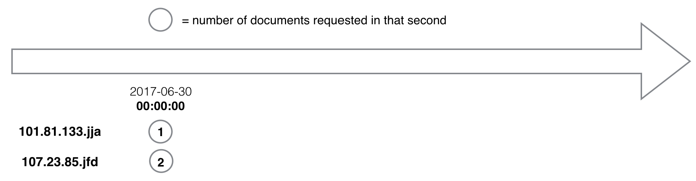
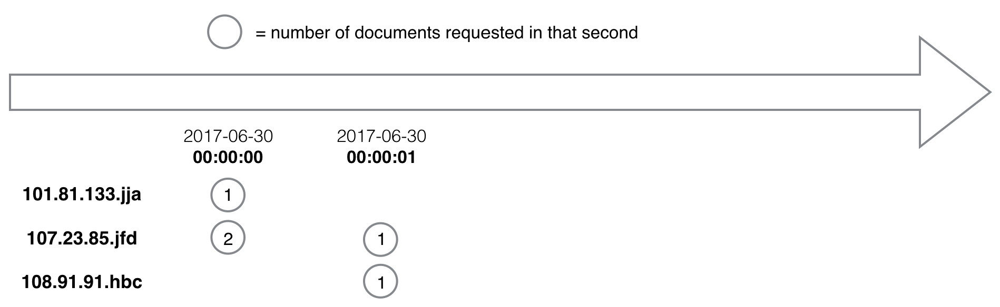
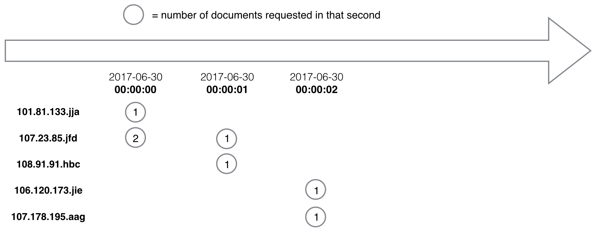
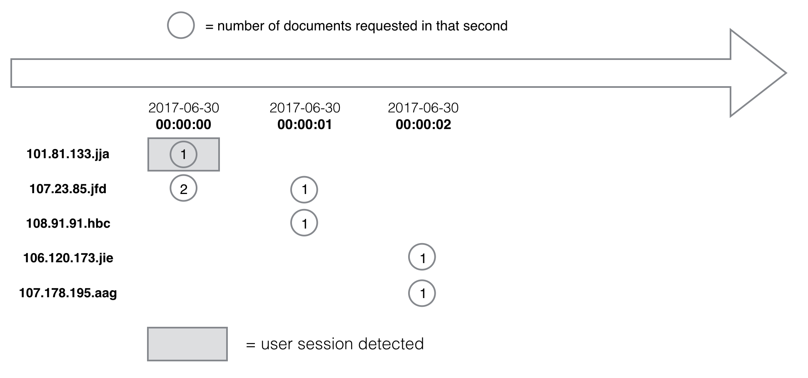
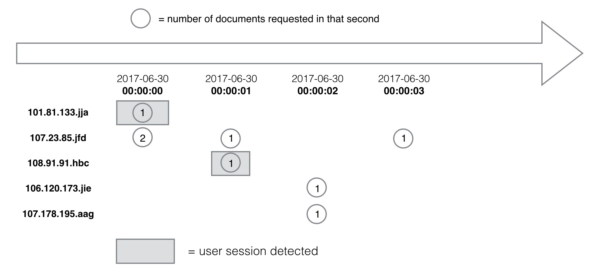
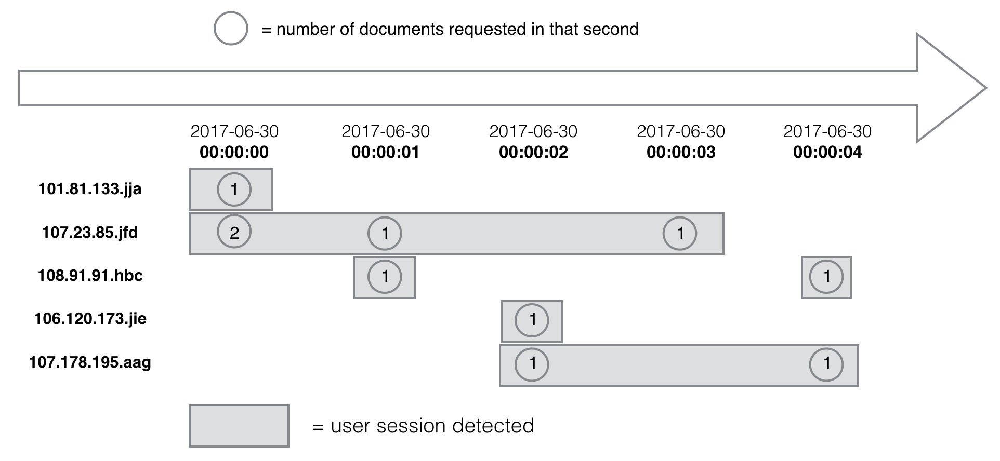

# Table of Contents
1. [Understanding the challenge](README.md#understanding-the-challenge)
2. [Introduction](README.md#introduction)
3. [Challenge summary](README.md#challenge-summary)
4. [Details of challenge](README.md#details-of-challenge)
5. [Implementation details](README.md#implementation-details)
6. [Input files](README.md#input-files)
7. [Output file](README.md#output-file)
8. [Example](README.md#example)
9. [Writing clean, scalable and well-tested code](README.md#writing-clean-scalable-and-well-tested-code)
10. [Repo directory structure](README.md#repo-directory-structure)
11. [Testing your directory structure and output format](README.md#testing-your-directory-structure-and-output-format)
11. [Instructions to submit your solution](README.md#instructions-to-submit-your-solution)
13. [FAQ](README.md#faq)

# Understanding the challenge

We highly recommend that you take a few dedicated minutes to read this README in its entirety before starting to think about potential solutions. You'll probably find it useful to review the examples and understand the problem at a high-level before digging into the specific details, many of which are covered in the FAQ.

# Introduction

Many investors, researchers, journalists and others use the Securities and Exchange Commission's Electronic Data Gathering, Analysis and Retrieval (EDGAR) system to retrieve financial documents, whether they are doing a deep dive into a particular company's financials or learning new information that a company has revealed through their filings. 

The SEC maintains EDGAR weblogs showing which IP addresses have accessed which documents for what company, and at what day and time this occurred.

Imagine the SEC has asked you to take the data and produce a dashboard that would provide a real-time view into how users are accessing EDGAR, including how long they stay and the number of documents they access during the visit.

While the SEC usually makes its EDGAR weblogs publicly available after a six month delay, imagine that for this challenge, the government entity has promised it would stream the data into your program in real-time and with no delay.

Your job as a data engineer is to build a pipeline to ingest that stream of data and calculate how long a particular user spends on EDGAR during a visit and how many documents that user requests during the session. 

# Challenge summary

For this challenge, we're asking you to take existing publicly available EDGAR weblogs and assume that each line represents a single web request for an EDGAR document that would be streamed into your program in real time. 

Using the data, identify when a user visits, calculate the duration of and number of documents requested during that visit, and then write the output to a file.

Your role on the project is to work on the data pipeline to hand off the information to the front-end. As the backend data engineer, you do **not** need to display the data or work on the dashboard but you do need to provide the information.

You can assume there is another process that takes what is written to the output file and sends it to the front-end. If we were building this pipeline in real life, we’d probably have another mechanism to send the output to the GUI rather than writing to a file. However, for the purposes of grading this challenge, we just want you to write the output to files.

# Details of challenge

For the purposes of this challenge, an IP address uniquely identifies a single user. A user is defined to have visited the EDGAR system if during the visit, the IP address requested one or more documents. 

Also, for the purposes of this challenge, the amount of time that elapses between document requests should be used to determine when a visit, also referred to as a session, begins and ends. 

A single user session is defined to have started when the IP address first requests a document from the EDGAR system and continues as long as the same user continues to make requests. The session is over after a certain period of time has elapsed -- we'll provide you that value -- and the user makes no requests for documents. 

In other words, this period of inactivity helps to determine when the session is over and the user is assumed to have left the system. 

The duration of any particular session is defined to be the time between the IP address' first request and the last one in the same session prior to the period of inactivity. If the user returns later to access another document requests, that subsequent request would be considered the start of a new session.

# Implementation details

Your program should expect two input files (be sure to read the section, "Repo directory structure", for details on where these files should be located):

* `log.csv`: EDGAR weblog data
* `inactivity_period.txt`: Holds a single value denoting the period of inactivity that should be used to identify when a user session is over

As you process the EDGAR weblogs line by line, the moment you detect a user session has ended, your program should write a line to an output file, `sessionization.txt`, listing the IP address, duration of the session and number of documents accessed.

The value found in `inactivity_period.txt` should be used to determine when a session has ended and when a new session has possibly started. However, once you reach the end of the `log.csv`, that last timestamp should signal the end of all current sessions regardless of whether the period of inactivity has been met.

## Input files

### `log.csv`

The SEC provides weblogs stretching back years and is [regularly updated, although with a six month delay](https://www.sec.gov/dera/data/edgar-log-file-data-set.html). 

For the purposes of this challenge, you can assume that the data is being streamed into your program in the same order that it appears in the file with the first line (after the header) being the first request and the last line being the latest. You also can assume the data is listed in chronological order for the purposes of this challenge.

While you're welcome to run your program using a subset of the data files found at the SEC's website, you should not assume that we'll be testing your program on any of those data files.

Also, while we won't expect your program to be able to process all of the SEC's weblogs (there is over 1TB of data), you should be prepared to talk about how you might design or redesign your program should the challenge be changed to require you to process hundreds of gigabytes or even a terabyte.

For the purposes of this challenge, below are the data fields you'll want to pay attention to from the SEC weblogs:

* `ip`: identifies the IP address of the device requesting the data. While the SEC anonymizes the last three digits, it uses a consistent formula that allows you to assume that any two `ip` fields with the duplicate values are referring to the same IP address
* `date`: date of the request (yyyy-mm-dd) 
* `time`:  time of the request (hh:mm:ss)
* `cik`: SEC Central Index Key
* `accession`: SEC document accession number
* `extention`: Value that helps determine the document being requested

There are other fields that can be found in the weblogs. For the purposes of this challenge, your program can ignore those other fields.

Unlike other weblogs that contain the actual http web request, the SEC's files use a different but deterministic convention. For the purposes of this challenge, you can assume the combination of `cik`, `accession` and `extention` fields uniquely identifies a single web page document request. Don't assume any particular format for any of those three fields (e.g., the fields can consist of numbers, letters, hyphens, periods and other characters)

The first line of `log.csv` will be a header denoting the names of the fields in each web request. Each field is separated by a comma. Your program should only use this header to determine the order in which the fields will appear in the rest of the other lines in the same file.

### `inactivity_period.txt`
This file will hold a single integer value denoting the period of inactivity (in seconds) that your program should use to identify a user session. The value will range from 1 to 86,400 (i.e., one second to 24 hours)

## Output file

Once your program identifies the start and end of a session, it should gather the following fields and write them out to a line in the output file, `sessionization.txt`. The fields on each line must be separated by a `,`:

* IP address of the user exactly as found in `log.csv`
* date and time of the first webpage request in the session (yyyy-mm-dd hh:mm:ss)
* date and time of the last webpage request in the session (yyyy-mm-dd hh:mm:ss)
* duration of the session in seconds
* count of webpage requests during the session

Unlike the input weblog data file and for the purposes of this challenge, your program should not write a header line to the output file but instead write just the results. Each line should have the fields in the exact order detailed above. Fields must be separated by a comma.

If your program is able to detect multiple user sessions ending at the same time, it should write the results to the `sessionization.txt` output file in the same order as the user's first request for that session appeared in the input `log.csv` file.

# Example

Suppose your input files contained only the following few lines. Note that the fields we are interested in are in **bold** below but will not be like that in the input file. There's also an extra newline between records below, but the input file won't have that.

**`inactivity_period.txt`**
> **2**

**`log.csv`**

>**ip,date,time**,zone,**cik,accession,extention**,code,size,idx,norefer,noagent,find,crawler,browser

>**101.81.133.jja,2017-06-30,00:00:00**,0.0,**1608552.0,0001047469-17-004337,-index.htm**,200.0,80251.0,1.0,0.0,0.0,9.0,0.0,

>**107.23.85.jfd,2017-06-30,00:00:00**,0.0,**1027281.0,0000898430-02-001167,-index.htm**,200.0,2825.0,1.0,0.0,0.0,10.0,0.0,

>**107.23.85.jfd,2017-06-30,00:00:00**,0.0,**1136894.0,0000905148-07-003827,-index.htm**,200.0,3021.0,1.0,0.0,0.0,10.0,0.0,

>**107.23.85.jfd,2017-06-30,00:00:01**,0.0,**841535.0,0000841535-98-000002,-index.html**,200.0,2699.0,1.0,0.0,0.0,10.0,0.0,

>**108.91.91.hbc,2017-06-30,00:00:01**,0.0,**1295391.0,0001209784-17-000052,.txt**,200.0,19884.0,0.0,0.0,0.0,10.0,0.0,

>**106.120.173.jie,2017-06-30,00:00:02**,0.0,**1470683.0,0001144204-14-046448,v385454_20fa.htm**,301.0,663.0,0.0,0.0,0.0,10.0,0.0,

>**107.178.195.aag,2017-06-30,00:00:02**,0.0,**1068124.0,0000350001-15-000854,-xbrl.zip**,404.0,784.0,0.0,0.0,0.0,10.0,1.0,

>**107.23.85.jfd,2017-06-30,00:00:03**,0.0,**842814.0,0000842814-98-000001,-index.html**,200.0,2690.0,1.0,0.0,0.0,10.0,0.0,

>**107.178.195.aag,2017-06-30,00:00:04**,0.0,**1068124.0,0000350001-15-000731,-xbrl.zip**,404.0,784.0,0.0,0.0,0.0,10.0,1.0,

>**108.91.91.hbc,2017-06-30,00:00:04**,0.0,**1618174.0,0001140361-17-026711,.txt**,301.0,674.0,0.0,0.0,0.0,10.0,0.0,

The single line on `inactivity_period.txt` tells us that once two seconds have elapsed since a user made a document request, we can assume that user's particular visit has ended. Any subsequent requests would be considered a new session.

The first day and time listed in the input file is 2017-06-30 and the time is 00:00:00. That means at that date and time, the following ip addresses initiated a visit to EDGAR:

* **101.81.133.jja** made a request for cik: **1608552.0**, accession: **0001047469-17-004337** and extention: **-index.htm**
* **107.23.85.jfd** made a request for cik: **1027281.0**, accession: **0000898430-02-001167** and extention: **-index.htm**
* **107.23.85.jfd** made a request for cik: **1136894.0**, accession: **0000905148-07-003827** and extention: **-index.htm**

So for the first second of data that your program has encountered, it knows one user has accessed one document and a second user has requested two:

When your program reads in the input file's fourth line, it should detect that the day and time has advanced by one second. So now, this is what we know:

Then when it reaches the sixth and seventh line:

When it first reads the eighth line, it should detect that the time is now `2017-06-30 00:00:03`. For one user, `101.8.33.jja`, its session has ended because two seconds of inactivity have passed for that user. Because there was only one request, only one web page document was accessed. 

At that point, the output file `sessionization.txt` should contain the following line:

    101.81.133.jja,2017-06-30 00:00:00,2017-06-30 00:00:00,1,1

After processing the eighth line of the input file and as we examine the timestamp in the ninth line of the input file, we detect that the time has progressed to `2017-06-30 00:00:04`. For a second user, `108.91.91.hbc`, we now see that two seconds of inactivity has elapsed and we can identify a second session:

The output file `sessionization.txt` should now consist of the following data:

    101.81.133.jja,2017-06-30 00:00:00,2017-06-30 00:00:00,1,1
    108.91.91.hbc,2017-06-30 00:00:01,2017-06-30 00:00:01,1,1

Finally, after your program processes the ninth and 10th line, it should detect that the end of file has been reached and there are no more requests for any users. At this point, it should identify all sessions regardless of the period of inactivity:

At that point, it should write the results to the output file, and the entire content of `sessionization.txt` should be:

    101.81.133.jja,2017-06-30 00:00:00,2017-06-30 00:00:00,1,1
    108.91.91.hbc,2017-06-30 00:00:01,2017-06-30 00:00:01,1,1
    107.23.85.jfd,2017-06-30 00:00:00,2017-06-30 00:00:03,4,4
    106.120.173.jie,2017-06-30 00:00:02,2017-06-30 00:00:02,1,1
    107.178.195.aag,2017-06-30 00:00:02,2017-06-30 00:00:04,3,2
    108.91.91.hbc,2017-06-30 00:00:04,2017-06-30 00:00:04,1,1

Notice from the above output that the first two lines were the ones we had already written. 

The third line details the session for `107.23.85.jfd` next because its first document request came at `2017-06-30 00:00:00`, which is earlier than any of the other remaining sessions. 

The fourth line belongs to IP address, `106.120.173.jie` because that user's first document request came at `2017-06-30 00:00:02`. The first document request from `107.178.195.aag` also comes at the same time but it is listed after `106.120.173.jie` in the input file so that is why it is listed on the fifth line.

The second session detected for `108.91.91.hbc` concludes the `sessionization.txt` file.

## Writing clean, scalable and well-tested code

As a data engineer, it’s important that you write clean, well-documented code that scales for large amounts of data. For this reason, it’s important to ensure that your solution works well for a large number of records, rather than just the above example.

It's also important to use software engineering best practices like unit tests, especially since data is not always clean and predictable. For more details about the implementation, please refer to the FAQ below. If further clarification is necessary, email us at <cc@insightdataengineering.com> but please do so only after you have read through the Readme and FAQ one more time and cannot find the answer to your question.

Before submitting your solution you should summarize your approach, dependencies and run instructions (if any) in your `README`.

You may write your solution in any mainstream programming language such as C, C++, C#, Clojure, Erlang, Go, Haskell, Java, Python, Ruby, or Scala. Once completed, submit a link to a Github repo with your source code.

In addition to the source code, the top-most directory of your repo must include the `input` and `output` directories, and a shell script named `run.sh` that compiles and runs the program(s) that implement the required features.

If your solution requires additional libraries, environments, or dependencies, you must specify these in your `README` documentation. See the figure below for the required structure of the top-most directory in your repo, or simply clone this repo.

## Repo directory structure

The directory structure for your repo should look like this:

    ├── README.md 
    ├── run.sh
    ├── src
    │   └── sessionization.py
    ├── input
    │   └── inactivity_period.txt
    │   └── log.csv
    ├── output
    |   └── sessionization.txt
    ├── insight_testsuite
        └── run_tests.sh
        └── tests
            └── test_1
            |   ├── input
            |   │   └── inactivity_period.txt
            |   │   └── log.csv
            |   |__ output
            |   │   └── sessionization.txt
            ├── your-own-test_1
                ├── input
                │   └── your-own-inputs
                |── output
                    └── sessionization.txt

**Don't fork this repo** and don't use this `README` instead of your own. The content of `src` does not need to be a single file called `sessionization.py`, which is only an example. Instead, you should include your own source files and give them expressive names.

## Testing your directory structure and output format

To make sure that your code has the correct directory structure and the format of the output files are correct, we have included a test script called `run_tests.sh` in the `insight_testsuite` folder.

The tests are stored simply as text files under the `insight_testsuite/tests` folder. Each test should have a separate folder with an `input` folder for `inactivity_period.txt` and `log.csv` and an `output` folder for `sessionization.txt`.

You can run the test with the following command from within the `insight_testsuite` folder:

    insight_testsuite~$ ./run_tests.sh 

On a failed test, the output of `run_tests.sh` should look like:

    [FAIL]: test_1
    [Thu Mar 30 16:28:01 PDT 2017] 0 of 1 tests passed

On success:

    [PASS]: test_1
    [Thu Mar 30 16:25:57 PDT 2017] 1 of 1 tests passed

One test has been provided as a way to check your formatting and simulate how we will be running tests when you submit your solution. We urge you to write your own additional tests. `test_1` is only intended to alert you if the directory structure or the output for this test is incorrect.

Your submission must pass at least the provided test in order to pass the coding challenge.

## Instructions to submit your solution
* To submit your entry please use the link you received in your coding challenge invite email
* You will only be able to submit through the link one time 
* Do NOT attach a file - we will not admit solutions which are attached files 
* Use the submission box to enter the link to your GitHub repo or Bitbucket ONLY
* Link to the specific repo for this project, not your general profile
* Put any comments in the README inside your project repo, not in the submission box
* We are unable to accept coding challenges that are emailed to us 

# FAQ

Here are some common questions we've received. If you have additional questions, please email us at `cc@insightdataengineering.com` and we'll answer your questions as quickly as we can (during PST business hours), and update this FAQ. Again, only contact us after you have read through the Readme and FAQ one more time and cannot find the answer to your question.

### Which Github link should I submit?
You should submit the URL for the top-level root of your repository. For example, this repo would be submitted by copying the URL `https://github.com/InsightDataScience/edgar-analytics` into the appropriate field on the application. **Do NOT try to submit your coding challenge using a pull request**, which would make your source code publicly available.

### Do I need a private Github repo?
No, you may use a public repo, there is no need to purchase a private repo. You may also submit a link to a Bitbucket repo if you prefer.

### Are the session durations inclusive or exclusive?  
As shown in the above example, the duration is inclusive. In other words, if the timestamps for the session start is 00:00:01 and session end is 00:00:03, the duration is 3 seconds.  

### What if there is a single request in a session?  
As shown in the above example, the minimum duration for a session is 1 second.  

### If a user requests the same document more than once during a session, how many webpage requests is that?
Every time a user accesses an EDGAR document, that request should be counted even if the user is requesting the same document multiple times. For instance, if within a session, there are two requests, once for cik: `1608552.0`, accession: `0001047469-17-004337` and extention: `-index.htm` and then a second time for the same exact combination, the count of webpage requests for that session would be 2.

### How do you know when a session is over?  
As shown in the above example, the session is over when the end of the file is reached or after a period of inactivity has elapsed with no requests from that user. For example, if the inactivity period is 2 seconds, and the session start is 00:00:01 and there are no further requests from that user by 00:00:04, then the session is considered over at 00:00:01.  

### Where can I get the input file, `log.csv`?
We've provided one example as shown above in this README for you to better understand the challenge but you should create your own data to test your program. You can obtain other data [directly from the SEC](https://www.sec.gov/dera/data/edgar-log-file-data-set.html) but be aware that the weblog files are quite large and you also may have problems decompressing the archive file. `Unzip` may not work on the EDGAR zip file, and you may have to use open source software such as `7zip`. If you are unable to decompress the zip file, revert to creating your own data for the challenge. Do not spend too long on trying to decompress the archive file.

### May I use R, Matlab, or other analytics programming languages to solve the challenge?
It's important that your implementation scales to handle large amounts of data. While many of our Fellows have experience with R and Matlab, applicants have found that these languages are unable to process data in a scalable fashion, so you must consider another language.

### May I use distributed technologies like Hadoop or Spark?
Your code will be tested on a single machine, so using these technologies will negatively impact your solution. We're not testing your knowledge on distributed computing, but rather on computer science fundamentals and software engineering best practices. 

### What sort of system should I use to run my program on (Windows, Linux, Mac)?
You may write your solution on any system, but your source code should be portable and work on all systems. Additionally, your `run.sh` must be able to run on either Unix or Linux, as that's the system that will be used for testing. Linux machines are the industry standard for most data engineering teams, so it is helpful to be familiar with this. If you're currently using Windows, we recommend installing a virtual Unix environment, such as VirtualBox or VMWare, and using that to develop your code. Otherwise, you also could use tools, such as Cygwin or Docker, or a free online IDE such as Cloud9.

### How fast should my program run?
While there are no strict performance guidelines to this coding challenge, we will consider the amount of time your program takes when grading the challenge. Therefore, you should design and develop your program in the optimal way (i.e. think about time and space complexity instead of trying to hit a specific run time value). 

### Can I use pre-built packages, modules, or libraries?
This coding challenge can be completed without any "exotic" packages. While you may use publicly available packages, modules, or libraries, you must document any dependencies in your accompanying README file. When we review your submission, we will download these libraries and attempt to run your program. If you do use a package, you should always ensure that the module you're using works efficiently for the specific use-case in the challenge, since many libraries are not designed for large amounts of data.

### Should I use the Pandas library for Python?  
While the Pandas library is useful for many problems related to small batches of data, it is not scalable at dealing with streaming data problems like this challenge. As a result, you should strongly consider alternative algorithms and data structus that scale with larger, streaming data.

### Will you email me if my code doesn't run?
Unfortunately, we receive hundreds of submissions in a very short time and are unable to email individuals if their code doesn't compile or run. This is why it's so important to document any dependencies you have, as described in the previous question. We will do everything we can to properly test your code, but this requires good documentation. More so, we have provided a test suite so you can confirm that your directory structure and format are correct.

### Can I use a database engine?
This coding challenge can be completed without the use of a database. However, if you use one, it must be a publicly available one that can be easily installed with minimal configuration.

### Do I need to use multi-threading?
No, your solution doesn't necessarily need to include multi-threading - there are many solutions that don't require multiple threads/cores or any distributed systems, but instead use efficient data structures.

### What should the format of the output be?
In order to be tested correctly, you must use the format described above. You can ensure that you have the correct format by using the testing suite we've included.

### Should I check if the files in the input directory are text files or non-text files(binary)?
No, for simplicity you may assume that all of the files in the input directory are text files, with the format as described above.

### Can I use an IDE like Eclipse or IntelliJ to write my program?
Yes, you can use whatever tools you want - as long as your `run.sh` script correctly runs the relevant target files and creates the `sessionization.txt` file in the `output` directory.

### What should be in the input directory?
You can put any text file you want in the directory since our testing suite will replace it. Indeed, using your own input files would be quite useful for testing. The file size limit on Github is 100 MB so you won't be able to include the larger sample input files in your `input` directory.

### How will the coding challenge be evaluated?
Generally, we will evaluate your coding challenge with a testing suite that provides a variety of inputs and checks the corresponding output. This suite will attempt to use your `run.sh` and is fairly tolerant of different runtime environments. Of course, there are many aspects (e.g. clean code, documentation) that cannot be tested by our suite, so each submission will also be reviewed manually by a data engineer.

### How long will it take for me to hear back from you about my submission?
We receive hundreds of submissions and try to evaluate them all in a timely manner. We try to get back to all applicants **within two or three weeks** of submission, but if you have a specific deadline that requires expedited review, please email us at `cc@insightdataengineering.com`.
